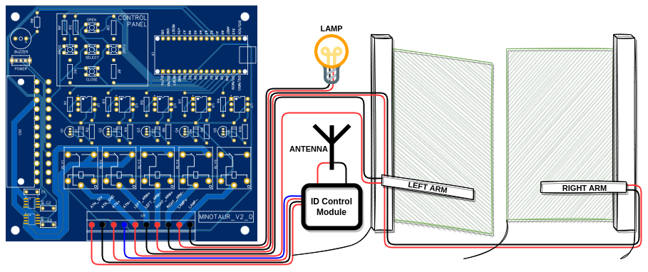

# Minotaur
Minotaur is an Arduino-based control board for automatic swing gates. This repository contains a full-stack implementation of Minotaur, including the fabrication files of the PCB, the list of parts, and the firmware to be loaded into the Arduino microcontroller.

- [The story behind Minotaur](#the-story-behind-minotaur)
- [Disclaimer](#disclaimer)
- [Content of this repository](#content-of-this-repository)
- [Hardware requirements](#hardware-requirements)
- [Getting started](#getting-started)
- [Using Minotaur](#using-minotaur)
  - [Programming mode](#programming-mode)
  - [Normal mode](#normal-mode)
- [Final notes](#final-notes)

## The story behind Minotaur
A long time ago, my dad spent over 500 € to install an automatic swing gate system on his property. The system was operational for over ten years, but recently I got a puppy whose favorite hobby was to destroy pretty much everything he could get his paws on (including the gate system). Since the gate system was already old and outdated, I struggled to find a control board that was compatible with the existing hardware. On top of that, the boards I found were too expensive, and the engineering was doubtful.

Therefore, I have decided to design myself a control board from scratch that could operate the hardware that my dog was merciful enough to spare. After a few months of procrastination, development, and debugging, Minotaur was born!

## Disclaimer
* **Minotaur only includes the control board**. The remaining hardware has to be purchased separately.
* All external hardware connected to Minotaur is powered with 12 V, namely the arms, the lamp, and the ID control module. **Do plug Minotaur into your own system if you are not sure of its requirements!**
* **WARNING: Minotaur v1.0 and v1.1 do not include OC protection and should not be used!**

## Content of this repository
* `/doc`: contains documentation regarding minotaur, namely the electronic schematics of the PCB;
* `/img`: contains images of the PCB and the illustration of a typical installation;
* `/pcb`: contains the files required to fabricate the PCB (Gerber) as well as the Bill of Materials (BOM), and a full backup of the EasyEDA project;
* `/src`: contains the source code of Minotaur that will run in the Arduino Nano installed in the PCB.

## Hardware requirements
The following hardware is required to build a system using Minotaur:

* An ATX power supply **(recommended: 500 W, OC Protection)**;
* An ID control module (connected to an antenna) **powered with 12 V** that acts as a button: when the antenna receives a valid signal (sent by a remote controller), it acts as a pressed button, short-circuiting the input and the output;
* Two **+12 V** motor arms: with +12 V, the arms open; with -12 V, the arms close;
* An Arduino Nano.

## Getting started

PCB Front |  PCB Back
-|-
 | 

* Get the Minotaur PCB (using the [Gerber file](/pcb/minotaur_v2_0_pcb_gerber.zip)) and the parts (listed in the [BOM](/pcb/minotaur_v2_0_BOM.csv)).
* Solder all components in the PCB according to the [schematics](doc/minotaur_v2_0_pcb_schematics.pdf). Additionally, solder two headers where the Arduino Nano will fit so that it can be removed or replaced.
* Plug the Arduino Nano into PCB and program it.
* To make sure that everything is working as it should, I find it helpful to connect the inputs and outputs of the board to dummy components (LEDs where the arms should be, a button instead of the antenna).
* Mount Minotaur as shown in [the example](/img/minotaur_v2_0_installation.png).
* It is now time to **enter the Programming mode** of Minotaur and get your setup working.

## Using Minotaur
Minotaur has two operation modes: **Programming** and **Normal**. By default, Minotaur is always operating in the Normal mode.

### Programming mode
The Programming mode serves to configure Minotaur with the opening and closing times of your swing gate. **The programming mode has to be executed right after installing the system to configure the opening and closing times of your swing gate. The gate must be fully closed before entering Programming mode.**

To enter the Programming mode, press the `PROG` button. You will hear three beeps and the lamp will start blinking. Press the `SELECT` button or activate the remote to start opening the left arm. Then, press it again to start opening the right arm. Press again `SELECT` when the left arm is fully opened, and again when the right arm finishes opening. Then, press `SELECT` to start closing the right arm and again to start closing the left arm. Press it again when the right arm is fully closed and again when the left arm finishes closing. You will hear two beeps and the lamp will stop blinking. Minotaur will now enter the Normal mode.

During the Programming cycle, Minotaur will learn the opening and closing times of your gate. If everything went well, you should now be able to open and close your gate by pressing `SELECT` or activating the remote. If that is not the case, feel free to execute another Programming cycle.

### Normal mode
* Press `SELECT` or activate the remote to open or close your swing gate.
* Press and hold `CLOSE` to close the left arm.
* Press and hold `CLOSE` and `FUNC` simultaneously to close the right arm.
* Press and hold `OPEN` to open the left arm.
* Press and hold `OPEN` and `FUNC` simultaneously to open the right arm.
* Press `PROG` to enter the Programming mode.

## Final notes
I decided to make Minotaur source available for multiple reasons:
* First, since I did not find related projects online, I hope someone else may find it interesting and useful. Also, since every component of Minotaur is open-source, it can be easily modified and adapted to the needs of other people.
* Second, I found it an interesting proof o concept to show that I master the technologies used in the development of Minotaur :smile:

Feel free to make suggestions on how to improve Minotaur!
